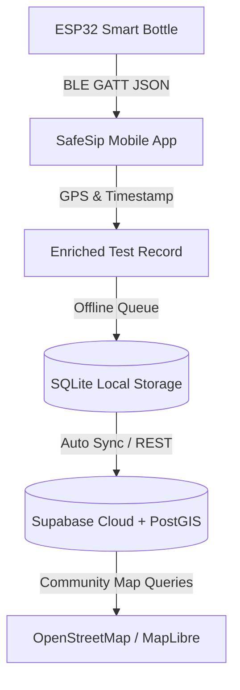

# SafeSip — Smart Portable Water-Quality Monitoring & Community Mapping System

SafeSip is a production-quality IoT health and hardware companion mobile application built for Android and iOS. It pairs with an ESP32-powered smart bottle to perform real-time multi-parameter physicochemical water analysis, classify water safety, enrich readings with GPS coordinates, store data offline, and contribute to an open community water safety map.

---

## 🌊 System Architecture



### Measured Parameters & Classification Thresholds:
| Parameter | Sensor Type | Safe Range | Caution Range | Unsafe Range |
| :--- | :--- | :--- | :--- | :--- |
| **pH** | Analog Glass Probe (E-201-C) | 6.5 – 8.5 | 6.0–6.5 / 8.5–9.0 | < 6.0 or > 9.0 |
| **TDS** | Gravity Analog Probe | < 300 ppm | 300 – 500 ppm | > 500 ppm |
| **Conductivity (EC)** | Platinum Cell / Calculated | 100 – 500 µS/cm | 500 – 800 µS/cm | > 800 µS/cm |
| **Turbidity** | Optical Scattering (TS-300B) | < 1.0 NTU | 1.0 – 5.0 NTU | > 5.0 NTU |
| **Temperature** | DS18B20 1-Wire Digital | 10.0 – 25.0 °C | 25.0 – 35.0 °C | > 35.0 °C |

---

## 📱 The 11 Major Screens

1. **SCREEN 1 — SPLASH**: SafeSip logo, brand tagline (*“Smart Water. Safer Lives.”*), subtle topographic water contour visual, and initialization indicator.
2. **SCREEN 2 — WELCOME / ONBOARDING**: Introduction featuring three concise feature cards (*Test Water Quality*, *Find Safe Sources*, *Contribute to Community*) and primary *Get Started* CTA.
3. **SCREEN 3 — SIGN UP**: Full Name, Email, Phone, Password validation, Google/Apple OAuth, and clear input error feedback.
4. **SCREEN 4 — LOGIN**: Email/phone & password login, Forgot Password link, and Supabase Auth session integration.
5. **SCREEN 5 — HOME DASHBOARD**: Greeting header (*“Hi, Vedant 👋”*), paired bottle battery/BLE status pill, hero **SAFE** card (*“Good quality for drinking”*), clean 5-parameter hierarchy, and primary *Test Water →* CTA.
6. **SCREEN 6 — CONNECT DEVICE**: Bluetooth pairing screen showing real scanning state, discovered devices (*SafeSip_0012 — Connected*, *SafeSip_0048 — Available*, *SafeSip_7781 — Available*), signal strength (RSSI), and GATT parameters.
7. **SCREEN 7 — LIVE TESTING**: Real-time water sampling screen with circular 0–100% progress indicator, multi-stage sampling text (*Purging chamber*, *Measuring optical turbidity*, etc.), live updating sensor values, and *Cancel Test* action.
8. **SCREEN 8 — TEST RESULTS**: Final physicochemical verdict badge (**SAFE**), all 5 measured parameters with reference ranges, *Save Result*, *Share Report*, and scientific non-certification disclaimer.
9. **SCREEN 9 — COMMUNITY WATER MAP**: OpenStreetMap interactive canvas with color-coded markers (**SAFE** = green, **CAUTION** = amber, **UNSAFE** = red, **UNVERIFIED** = gray), top search bar, status filters, and compact bottom sheet preview.
10. **SCREEN 10 — SOURCE DETAILS**: Selected source profile with hero visual, 3-tab layout (**Overview**, **History**, **Graph** with 30-day stability trend lines), and *View on Map* / *Test Here* CTAs.
11. **SCREEN 11 — TEST HISTORY**: Chronological test record log, status badges, parameter summaries, filter modal (by status & sort order), and **Export CSV** feature.

---

## 🔌 Hardware & BLE GATT Specification

### BLE Configuration:
- **Service UUID**: `4fafc201-1fb5-459e-8fcc-c5c9c331914b` (Primary SafeSip Service)
- **Sensor Telemetry Characteristic**: `beb5483e-36e1-4688-b7f5-ea07361b26a8` (Notify / Read)
- **Command Characteristic**: `1c95d5e3-d8f7-413a-bf3d-7a2e5d7be87e` (Write: `START_TEST`, `STOP_TEST`)
- **Battery Service**: `0000180f-0000-1000-8000-00805f9b34fb`

### JSON Telemetry Payload:
```json
{
  "ph": 7.4,
  "tds": 125,
  "ec": 310,
  "turb": 0.8,
  "temp": 22.5,
  "status": "SAFE",
  "progress": 68
}
```

The ESP32 FreeRTOS sketch is available in [`firmware/esp32_safesip_bottle.ino`](./firmware/esp32_safesip_bottle.ino).

---

## 🗄️ Database & Cloud Schema (Supabase + PostGIS)

PostgreSQL schema and PostGIS triggers are located in [`supabase/migrations/20261008_safesip_init.sql`](./supabase/migrations/20261008_safesip_init.sql).

- `public.users`: Profiles linked with Supabase Auth
- `public.devices`: Paired ESP32 bottles with MAC addresses and firmware versions
- `public.water_sources`: Community mapped sources with `geography(Point, 4326)` and automatic 30-day expiration to `UNVERIFIED`
- `public.water_tests`: Time-series sensor readings enriched with GPS coordinates and auto-updating trigger on water sources

---

## 🚀 Running the Project

```bash
# Navigate to project
cd SafeSip

# Start Metro Bundler
npm start

# Run on Android
npm run android

# Run on iOS (macOS only)
npm run ios
```
